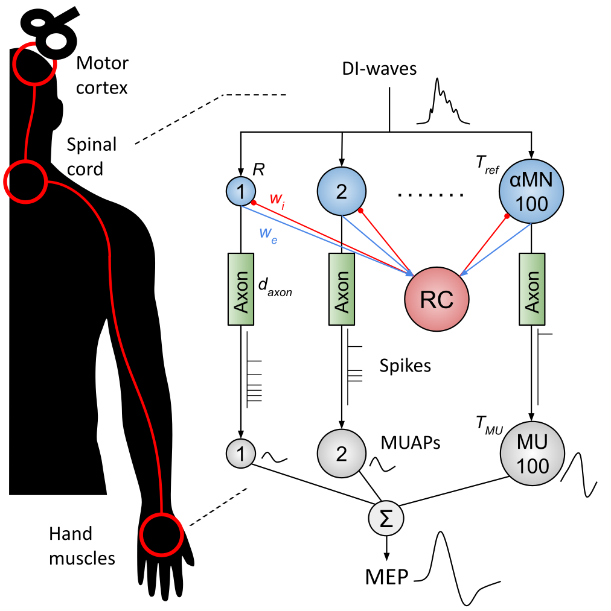
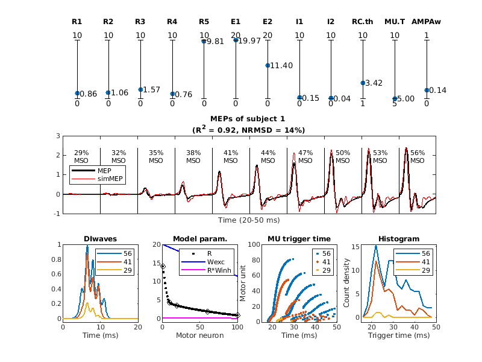
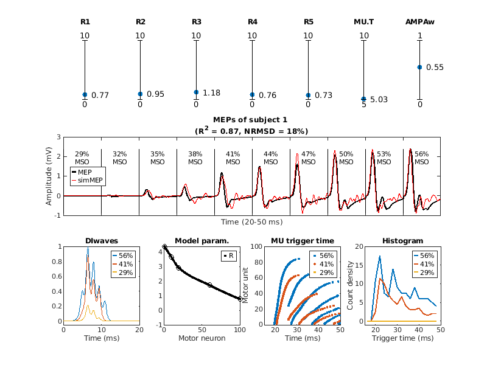
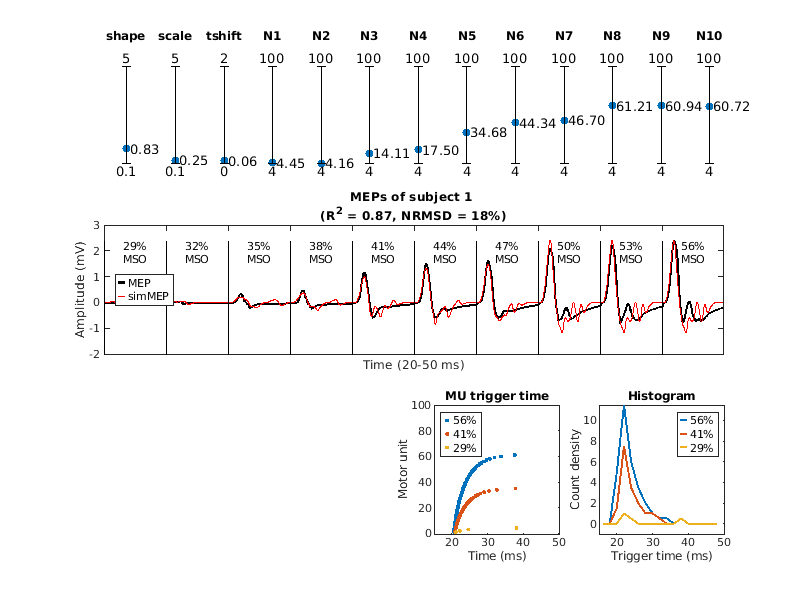

# A Biological Model of Spinal and Peripheral Motor Pathways for TMS-induced MEPs


## Description
```
1. Load motor-evoked potential (MEP) waveforms under different TMS intensities.
2. Generate simulated DI-waves based on the given TMS intensities.
3. Optimize model parameters to fit the MEP waveforms.

<MEP dataset>
Sorkhabi, M. M., Wendt, K., O'Shea, J., & Denison, T. (2022, April 9).
EMG data for Pulse width modulation-based TMS: Primary Motor Cortex
Responses compared to Conventional Monophasic Stimuli.
DOI: https://doi.org/10.1016/j.brs.2022.06.013
Dataset:  https://osf.io/5ry92/
```
**🥗For model performance, please see [Here](scripts/).**

<p align="center">
  <a href="model_description.pdf">
    
  </a>
</p>


## Matlab demo script
### 1️⃣ Biological model
```matlab
subj       = 1;  % subject 1~10
withRC     = 1;  % 0: biological model without RC 
                 % 1: biological model with RC
AMPAweight = []; % []:free parameter range [0,1]
                 %    or a fixed value within [0,1]               
reRun      = 0;  % 0: Load fitted result and plot simulated MEP.  
                 % 1: Rerun model fitting. Backup previous fitted result
ga_MEPmodel_bio(subj,withRC,AMPAweight,reRun);
```
<p align="center">
  <a href="scripts/figures/demo_s1_bio_panel.png">
    
  </a>
</p>

### 2️⃣ Biological model (no Renshaw cells)
```matlab
subj       = 1;  % subject 1~10
withRC     = 0;  % 0: biological model without RC 
                 % 1: biological model with RC
AMPAweight = []; % []:free parameter range [0,1]
                 %    or a fixed value within [0,1]               
reRun      = 0;  % 0: Load fitted result and plot simulated MEP.  
                 % 1: Rerun model fitting. Backup previous fitted result
ga_MEPmodel_bio(subj,withRC,AMPAweight,reRun);
```
<p align="center">
  <a href="scripts/figures/demo_s1_noRC_panel.png">
    
  </a>
</p>

### 3️⃣ Phenomenological model
```matlab
subj       = 1; % subject 1~10
reRun      = 0; % 0: Load fitted result and plot simulated MEP.  
                % 1: Rerun model fitting. Backup previous fitted result
ga_MEPmodel_pheno(subj,reRun);
```
<p align="center">
  <a href="scripts/figures/demo_s1_pheno_panel.png">
    
  </a>
</p>
