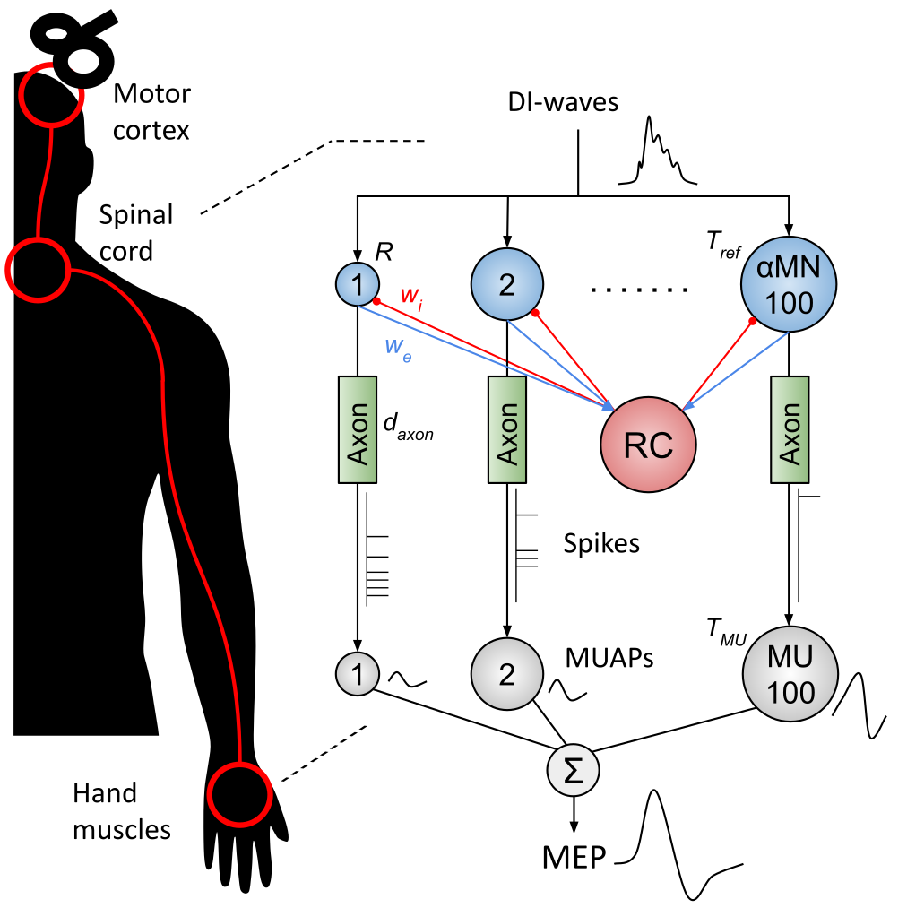
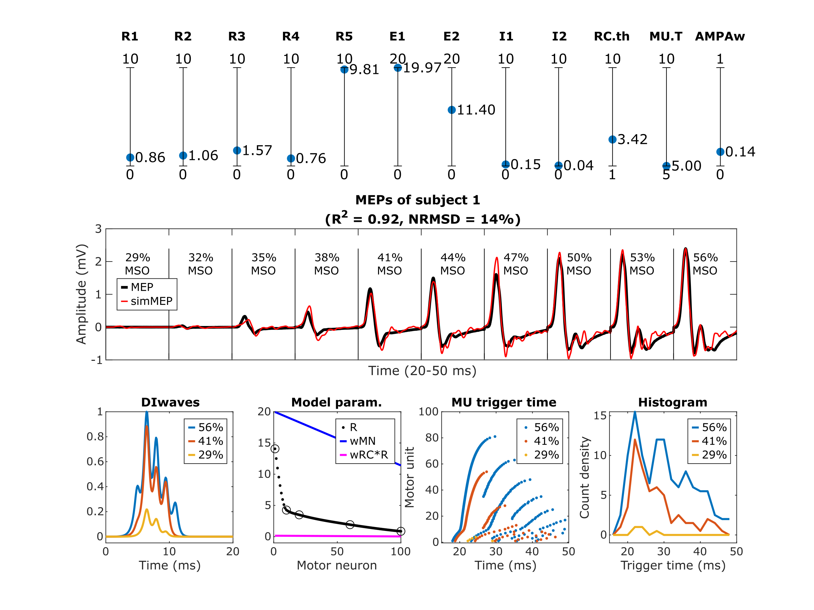
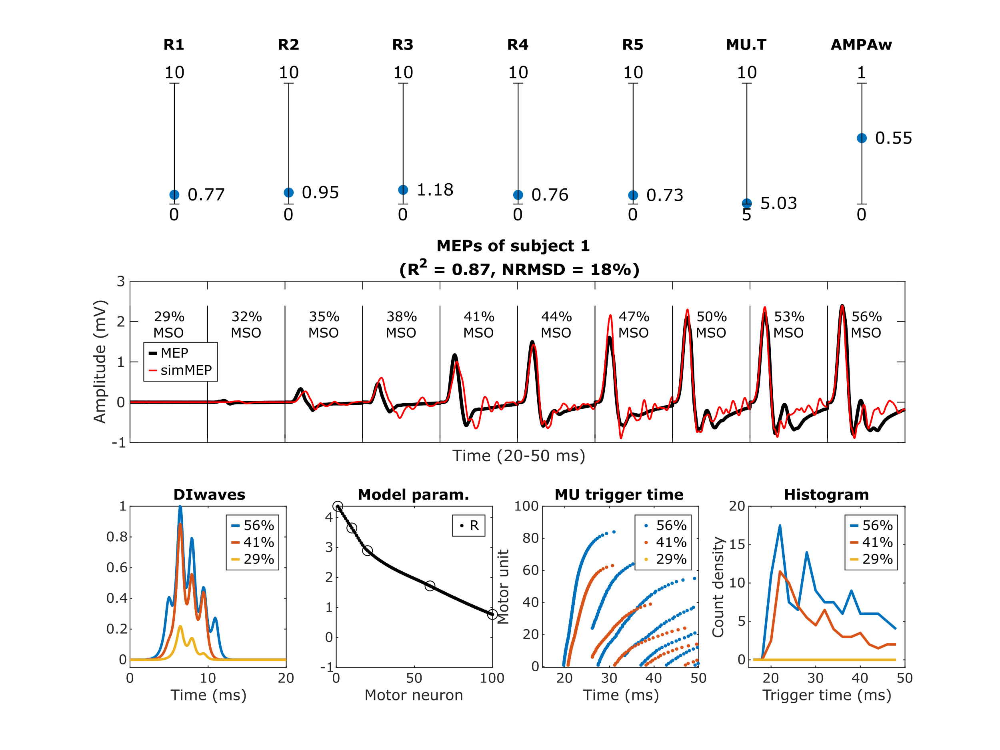
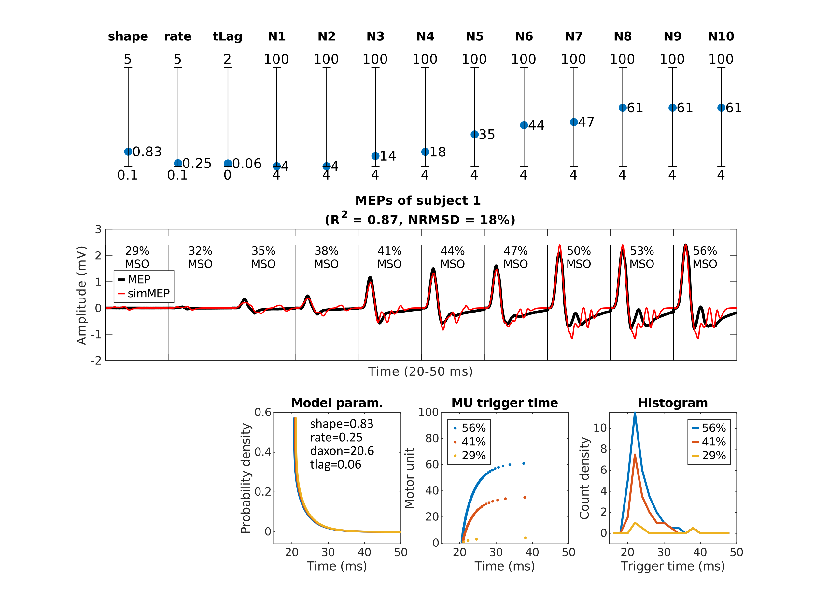

## Optimizer

This repository contains a hybrid optimization algorithm that combines a genetic algorithm (GA) with local gradient-based search to fit a model's parameters to a target dataset. The algorithm is adapted from the previous work of Dr. Peng Wang [1,2] and his colleague, Dr. Vincent Chien [2]. The Python implementation can be found in https://github.com/EleBern/Optimizer.

[1] Wang, P., Kong, R., Kong, X., Liégeois, R., Orban, C., Deco, G., ... & Thomas Yeo, B. T. (2019). Inversion of a large-scale circuit model reveals a cortical hierarchy in the dynamic resting human brain. Science advances, 5(1), eaat7854.

[2] Chien, V. S., Wang, P., Maess, B., Fishman, Y., & Knösche, T. R. (2023). Laminar neural dynamics of auditory evoked responses: Computational modeling of local field potentials in auditory cortex of non-human primates. NeuroImage, 281, 120364.

## A Biological Model of Spinal and Peripheral Motor Pathways for TMS-induced MEPs

This repository provides tools to model and analyze **motor-evoked potentials (MEPs)** generated by **transcranial magnetic stimulation (TMS)**.  
The workflow involves three main steps:

1. **Load experimental data** – Import MEP waveforms recorded under different TMS intensities [1].  
2. **Generate model inputs** – Simulate DI-waves based on the given TMS intensities.  
3. **Optimize model parameters** – Fit the model to experimental MEP waveforms using optimization techniques.


[1] Sorkhabi, M. M., Wendt, K., O'Shea, J., & Denison, T. (2022, April 9). *EMG data for Pulse width modulation-based TMS: Primary Motor Cortex Responses compared to Conventional Monophasic Stimuli.*
DOI: [10.1016/j.brs.2022.06.013](https://doi.org/10.1016/j.brs.2022.06.013)  
**MEP dataset**: [https://osf.io/5ry92/](https://osf.io/5ry92/)

## 🥗 Model Evaluation

To **evaluate model performance**, we compared **three different models** in terms of their goodness-of-fit to experimental MEP waveforms.

1. **Biological model (with Renshaw cells)**: The motor-unit action potentials (MUAPs) are triggered by spikes of the motor neurons (MNs) that interact with Renshaw cells (RC). 
2. **Biological model (without Renshaw cells)**: The MUAPs are triggered by spikes of the MNs.  
3. **Phenomenological model**: The MUAPs are triggered by spikes that follow a [gamma ditribution](https://en.wikipedia.org/wiki/Gamma_distribution).

📂 Detailed scripts and analysis can be found in the [`scripts/`](scripts/) directory.


<p align="center">
  <a href="model_description.pdf">
    
  </a>
</p>

## Folder Structure
```bash
📂 MEPmodeling
├── README.md             # This file
├── GA/                   # Genetic algorithm toolbox
├── data_Oxford_MEP/      # Data (MEP dataset)
├── data_MUAP/            # Data (Motor unit action potentials)
├── MyelinatedAxonModel/  # Data (Extracellular potential)
├── fitted_results/      
│   ├── bio/              # Biological model (with Renshaw cells)
│   ├── bioNoRC/          # Biological model (without Renshaw cells)
│   └── pheno/            # Phenomenological model
└── scripts/              # Matlab scripts
    └── figures/          

```

## Matlab Demo Script
### 1️⃣ Biological model
```matlab
subj       = 1;  % subject 1–10
withRC     = 1;  % 0: biological model without RC 
                 % 1: biological model with RC
AMPAweight = []; % []:free parameter range [0,1]
                 %    or a fixed value within [0,1]               
reRun      = 0;  % 0: Load fitted result and plot simulated MEP.  
                 % 1: Rerun model fitting. Back up previous fitted result
ga_MEPmodel_bio(subj,withRC,AMPAweight,reRun);
```
<p align="center">
  <a href="scripts/figures/demo_s1_bio_panel.png">
    
  </a>
</p>

### 2️⃣ Biological model (no Renshaw cells)
```matlab
subj       = 1;  % subject 1–10
withRC     = 0;  % 0: biological model without RC 
                 % 1: biological model with RC
AMPAweight = []; % []:free parameter range [0,1]
                 %    or a fixed value within [0,1]               
reRun      = 0;  % 0: Load fitted result and plot simulated MEP.  
                 % 1: Rerun model fitting. Back up previous fitted result
ga_MEPmodel_bio(subj,withRC,AMPAweight,reRun);
```
<p align="center">
  <a href="scripts/figures/demo_s1_noRC_panel.png">
    
  </a>
</p>

### 3️⃣ Phenomenological model
```matlab
subj       = 1; % subject 1–10
reRun      = 0; % 0: Load fitted result and plot simulated MEP.  
                % 1: Rerun model fitting. Back up previous fitted result
ga_MEPmodel_pheno(subj,reRun);
```
<p align="center">
  <a href="scripts/figures/demo_s1_pheno_panel.png">
    
  </a>
</p>
