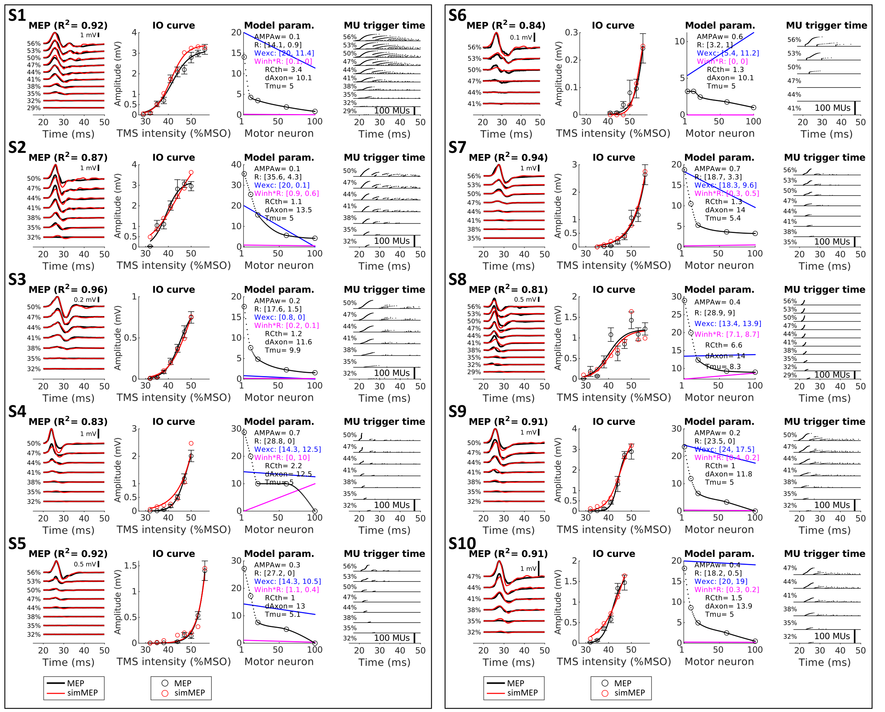
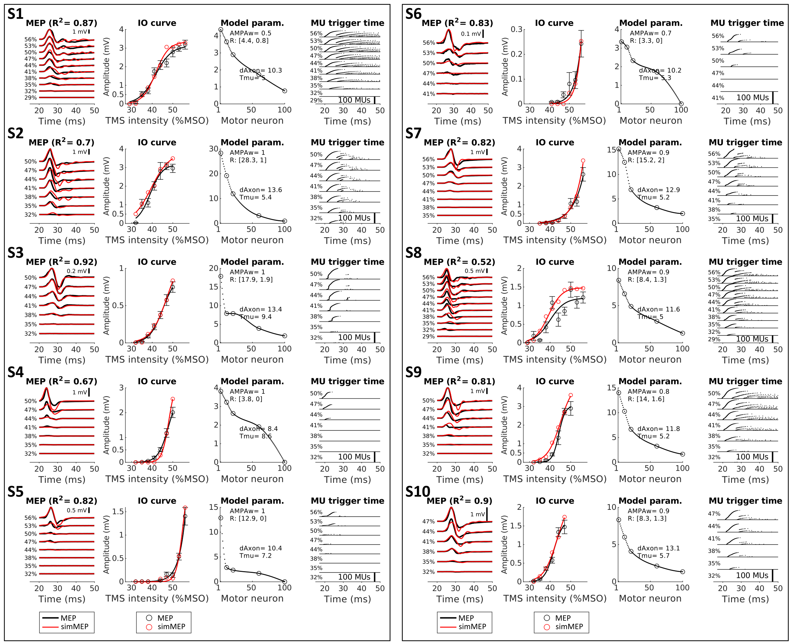
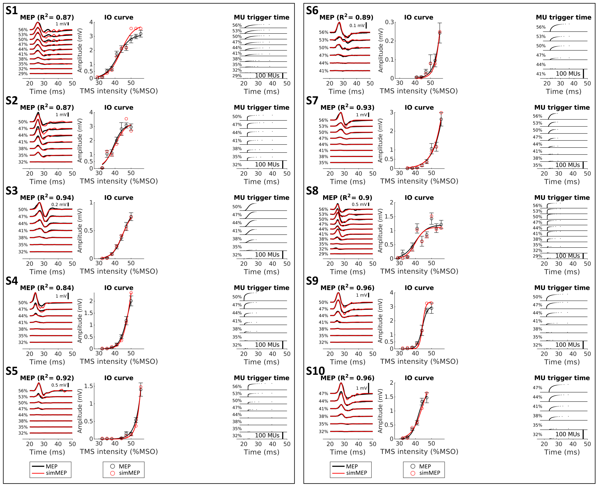
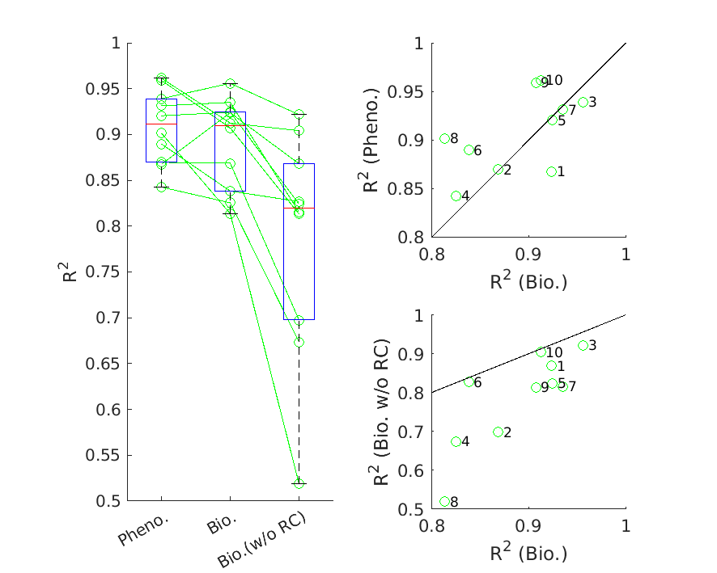

# Model performance (goodness-of-fit to the MEPs of 10 subjects)
## 1️⃣ Biological model
<p align="center">
  <a href="figures/fig_result_full.pdf">
    
  </a>
</p>
## 2️⃣ Biological model (no Renshaw cells)
<p align="center">
  <a href="figures/fig_result_noRC.pdf">
    
  </a>
</p>
## 3️⃣ Phenomenological model
<p align="center">
  <a href="figures/fig_result_pheno.pdf">
    
  </a>
</p>

## Comparison
```matlab
fig_result_summary()
```
<p align="center">
  <a href="figures/fig_result_summary.pdf">
    
  </a>
</p>
